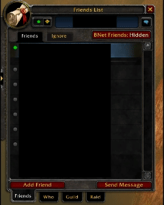
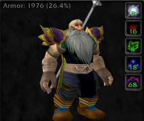
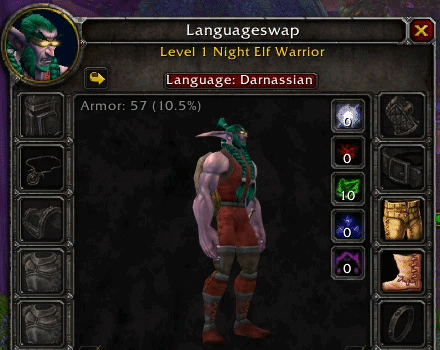
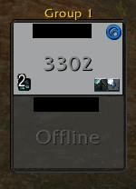
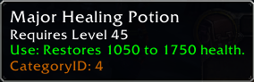
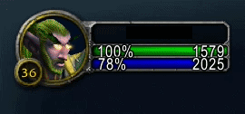
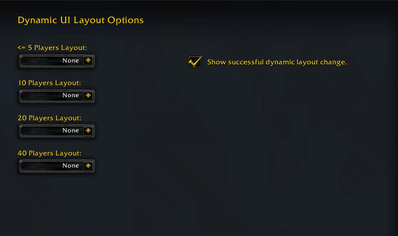

# WoW Classic Hardcore Addons

Collection of addons created and updated by and for myself, compatible with Classic Hardcore 1.15.9.

All addons are provided "as is", without warranty of any kind. I do not claim ownership of the original code for the addons located in the `Updated Addons` folder. Original authors are credited via links to their respective project pages, and all modifications are strictly documented below.

# Auto-Update (Require [WowUp application](https://wowup.io))

* **You can receive the updates automatically from my github if you uses the WowUp application**
	
	Launch the WowUp application, on the left side, navigate to "Get Addons", top right "Install from URL", paste `https://github.com/Makpptfox/WoW-HC-AddOns` in the "Addon URL" field, press "Import" then press "Install". 
	Once completed, my GitHub avatar will appear, and WowUp will automatically fetch all addons every time a new release is pushed to this repository.
	
* **You can safely disable any specific addon you do not wish to use directly from the in-game addon menu without impacting the functionality of the rest of the pack.**
	
---

## 🛠️ Created Addons

  
BNFriendsToggle:

    Adds a button in the friend list to toggle the display of Battle.net friends on or off.
	
&nbsp;

  
CPArmor:

    Adds a small text indicator on the top left of the character panel to show armor and % physical damage reduction. Eliminates the need to open the defense tab for this specific metric.
	
&nbsp;

  
DCAlert:

    Provides a warning when the client loses server connection.
	
&nbsp;

  
DynamicTooltip:

    Anchors the tooltip to the cursor and replaces it by default during combat. Fixes tooltip lingering when slowly hovering and holding left-click to move the camera.
	
&nbsp;

  
LanguageSwapper:

    Creates a button in the character panel to smoothly swap between known languages.
	
&nbsp;

  
RDH (RaidDispelHighlight):

    Highlights the victim's raid frame with a pulse when a dispelable debuff is applied.
	
&nbsp;

  
SSB (SoulSeeker Begone):

    Removes the occasional "-Soulseeker" suffix from player nicknames in the chat, reducing visual clutter specific to the HC environment.
	
&nbsp;

  
CategoryChecker:

    Checks if an item has a category cooldown (i.e. potions) and if so shows it in the tooltip.
	
&nbsp;

  
VanillaDruidManaBar:

    Adds a fully configurable mana bar while in cat or bear form while staying true to the vanilla visual design.
	
&nbsp;

  
DynamicUILayout:

    Dynamically change the UI layout that you have already saved in Edit Mode depending on the size of your group.

---

## 🔄 Updated Addons (Forks)

### [TheoryCraftClassic](https://www.curseforge.com/wow/addons/theorycraftclassic)
> *"Tells you everything about an ability, right on the tooltip."*

**Implemented Fixes:**
* Fixed the addon failing to initialize.
* Fixed missing values in the grimoire.
* Fixed outdated talent auto-detection.
* Fixed the `totalmana` Lua error.
* Fixed inconsistent HPS/DPS detection.
* Fixed the "-1000 sec" cast time display bug for certain instant cast spells.
* Fixed real-time updating for spell numbers on the UI.
* Fixed the "Vitals" tab not displaying informations correctly in the TC pannel when playing a Druid (Display depends on the form).

### [Talented Classic](https://www.curseforge.com/wow/addons/talented-classic)
> *"A replacement talent UI that allows creation and application of templates for any class, and viewing of all talent trees in one window."*

**Implemented Fixes:**
* Fixed the inability to swap talents when dual spec is usable.
* Fixed some talents not being selectable or having no tooltip.
* Removed the pet talents tab as there is no pet talents in Classic HC.

### [Sigma Profession Filter (Classic)](https://www.curseforge.com/wow/addons/sigma-profession-filter-classic)
> *"WoWClassic Addon to filter the recipes of professions"*

**Implemented Fixes:**
* Fixed UI&Checkboxes positioning.
* Fixed errors when recipes don't have a header.
* Fixed random refreshes when the window was opened for the first time after a login/reload.
* Fixed an arithmetic crash when opening professions (like First Aid) caused by uncached items returning a missing item level.
* Fixed Lua errors and crashes caused by querying invalid or removed spell IDs from the client database.
* Fixed crashes in the Search Box and "Toggle Unlearned Recipes" filters when encountering missing spell names.
* Fixed a missing table initialization (OriginalHeaders) that was completely breaking the Crafting window.
* Fixed frame initialization issues by safely hooking into Blizzard's native UI lifecycle.
* Fixed caching logic to safely load missing reagents, tools, and created items without throwing exceptions.
* Fixed the "Training Points" label anchor offset resetting when collapsing headers with Leatrix Plus enabled.
* Fixed 23rd line not being able to render when Leatrix Plus was enabled.
* Fixed the "Craft Reagent: X" not multiplicating by the amount of item you plan to craft.

---

## 📄 License & Distribution Policy

* **Usage Permitted:** You are granted a free, non-exclusive license to download, install, and use the addons contained in this repository for any gameplay purposes, including monetized live streaming and video creation (Twitch, YouTube, etc.).
* **Strict No Redistribution:** Reposting, redistributing, packaging, or uploading any of the originally created addons or the specific updated forks provided in this repository to platforms like CurseForge, WoWInterface, WowUp, or any other third-party site is strictly prohibited without explicit, prior written authorization.
* **No Commercial Distribution:** You may not monetize the addon files themselves. Selling the addons, gating them behind paywalls (e.g., Patreon), or including them in any paid compilations or premium client packages is strictly forbidden.
* **Updated Addons (Forks):** The original underlying code of the addons in the `Updated Addons/` folder remains under their original zlib license. However, the specific modifications, fixes, and distributions provided in this repository are governed by the strict non-redistribution and non-commercial distribution policies outlined above.
* **Sigma Profession Filter (Classic):** The original codebase by Sigma88 is strictly "All Rights Reserved". However, explicit written authorization has been granted by the original author to fork, improve, and host this updated version on this GitHub repository. Full credit for the original creation belongs to Sigma88. This specific fork remains strictly bound by the non-redistribution and non-commercial policies outlined above.
* **Reasoning:** I do not want to have to handle the addon websites' communities and people (outside of my github), neither do I want people abusing my work to make a buck, nor do I want the updated addons being reposted on said websites, out of respect for the original creators (whom, as of writing this, haven't updated said addons on their original pages in years) and to maintain control over the distribution of these specific forks.
